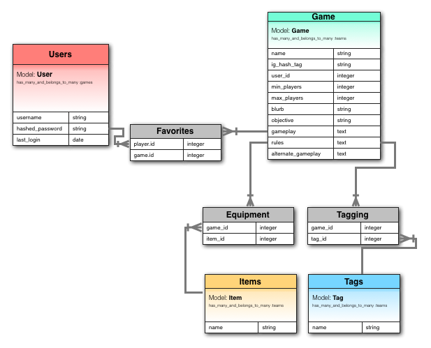
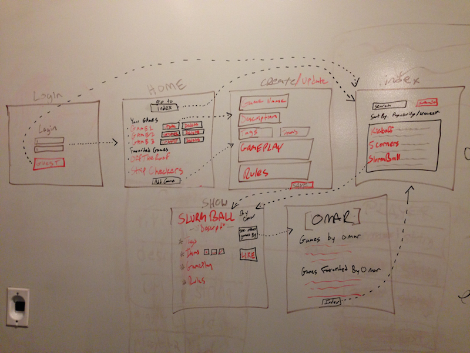

wdi_project_one
===============

First project of WDI course

## PLANNING & DELIVERABLES

####Project Plan deliverables:

* **Scope.**
What are you planning to build?
A user generated social game/sport sharing sit.

What features will it have?
Users can browse a database of games, search for games by tags and params, and even create their own games to share with others. The games will be classified by many params including number of players and equipment necessary to play. Also, the games will be classified by many tags (i.e. 'indoor', 'card-game', 'single-player'). The site will use a google images API to pull thumbnails related to the equipment required and an instagram API will search for any instagram photos of people playing the game (by searching by game specific hashtag).

What do you think you can reasonably implement in the time period?
In this 'sprint' week I think I can set up the CRUD of these games and have google api search for images of the items necessary. The site will be searchable by game name and possibly by tags/params and it will give users options to like a game. 

* **Object Models.** 

* **Wireframes.** 

* **Resources.** 
* https://github.com/google/google-api-ruby-client
* https://code.google.com/p/google-api-ruby-client/
* https://rubygems.org/gems/google-api-client
* http://instagram.com/developer/
* https://github.com/Instagram/instagram-ruby-gem
* https://rubygems.org/gems/instagram

* **Trello.**
* https://trello.com/b/HNrgk8lG/wdi-project-one

